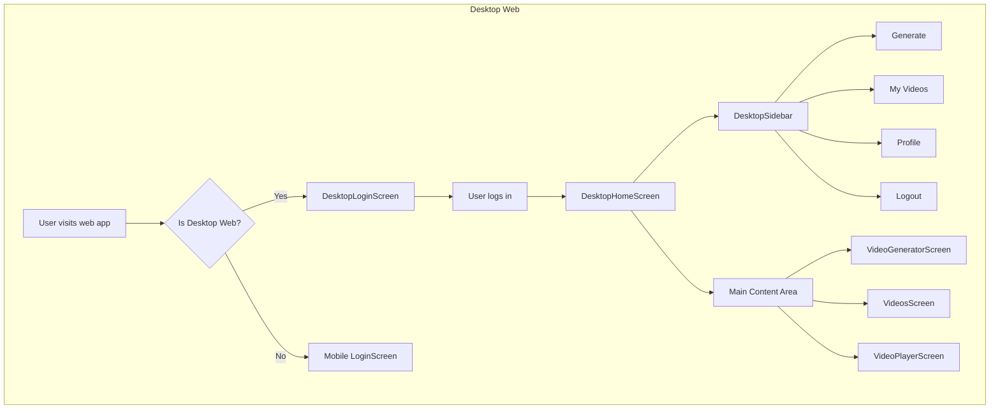

# Desktop Web Redesign Plan

## Problem Statement
The current Flutter web app displays the mobile app centered with a max-width of 600px, leaving white space on the sides. The user wants a modern desktop web experience with sidebar navigation and full-width content area.

## Current Architecture
- **Mobile-first design**: All screens built for mobile (Scaffold, Drawer, vertical layouts)
- **ResponsiveLayout**: Currently constrains desktop to 600px max-width
- **Screens**: LoginScreen, HomeScreen (contains VideoGeneratorScreen + VideosScreen), VideoPlayerScreen
- **Navigation**: Drawer (hamburger menu) on mobile

## Target Desktop Architecture
```
┌─────────────────────────────────────────────────────────────┐
│  ┌──────────┬────────────────────────────────────────────┐  │
│  │          │  Top Bar / Header                           │  │
│  │ SIDEBAR  ├────────────────────────────────────────────┤  │
│  │          │                                            │  │
│  │ - Home   │  MAIN CONTENT AREA                         │  │
│  │ - Videos │  (Video Generator / Videos Grid / Player)  │  │
│  │ - Profile│                                            │  │
│  │ - Logout │                                            │  │
│  │          │                                            │  │
│  └──────────┴────────────────────────────────────────────┘  │
└─────────────────────────────────────────────────────────────┘
```

## Implementation Plan

### 1. Create Desktop Navigation Sidebar
- **File**: `lib/widgets/desktop_sidebar.dart`
- **Features**:
  - Fixed left sidebar (width: 240px)
  - Logo at top
  - Navigation items: Generate, My Videos, Profile, Logout
  - Active state highlighting
  - Hover effects
  - Collapsible to icon-only mode (64px)

### 2. Create Desktop Home Screen
- **File**: `lib/screens/desktop_home_screen.dart`
- **Layout**:
  - Row: [DesktopSidebar (240px)] + [Main Content (expanded)]
  - Main content: TopBar + VideoGeneratorScreen/VideosScreen
  - Remove Drawer (replaced by sidebar)

### 3. Create Desktop Login Screen
- **File**: `lib/screens/desktop_login_screen.dart`
- **Layout**:
  - Centered card (max-width: 480px)
  - Logo at top
  - Larger buttons and text
  - More generous spacing
  - Background gradient or subtle pattern

### 4. Update ResponsiveLayout Widget
- **File**: `lib/widgets/responsive_layout.dart`
- **Changes**:
  - Add `desktopWidget` parameter to constructor
  - Update main.dart to pass desktopWidget for each screen
  - Properly detect web desktop (not just any desktop)

### 5. Update main.dart
- **Changes**:
  - Pass desktopWidget to ResponsiveLayout for each route
  - Use DesktopLoginScreen for login on web desktop
  - Use DesktopHomeScreen for home on web desktop

### 6. Platform Detection
- **File**: `lib/utils/platform_helper.dart`
- **Enhance**: Add `isWebDesktop` detection (web + width > 900px)

## Files to Create
1. `lib/widgets/desktop_sidebar.dart` - Navigation sidebar
2. `lib/screens/desktop_home_screen.dart` - Desktop home layout
3. `lib/screens/desktop_login_screen.dart` - Desktop login layout

## Files to Modify
1. `lib/widgets/responsive_layout.dart` - Add desktop widget support
2. `lib/main.dart` - Wire up desktop screens
3. `lib/utils/platform_helper.dart` - Add web desktop detection

## Design Specifications

### Sidebar
- Width: 240px (collapsed: 64px)
- Background: AppColors.surface1 (#212121)
- Active item: AppColors.neonGreen background with 10% opacity
- Text: AppColors.textPrimary (#E6E6E6)
- Icons: 24px, AppColors.textSecondary (#999999)
- Hover: Surface2 background

### Desktop Login Card
- Max-width: 480px
- Padding: 48px
- Background: AppColors.surface1
- Border-radius: 16px
- Button height: 56px (vs 52px mobile)
- Font sizes: +2px from mobile

### Desktop Content Area
- Full available width minus sidebar
- TopBar: Full width, 64px height
- Content: Proper grid layouts for videos
- Video cards: Larger, more per row (4-6 vs 2-3)

## Mermaid Diagram - Desktop Layout



## Implementation Order
1. Create DesktopSidebar widget
2. Create DesktopLoginScreen
3. Create DesktopHomeScreen
4. Update ResponsiveLayout to support desktopWidget
5. Update main.dart to use desktop screens
6. Test and verify

## Backward Compatibility
- Mobile app unchanged
- Tablet uses mobile layout (or could get simplified tablet layout)
- Native desktop (Windows/Mac/Linux) could also use desktop layout